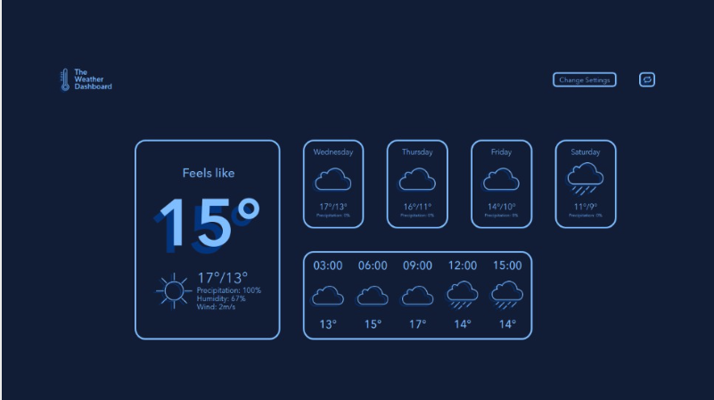

  
    
 ## Live link 
 https:google.com
    
  
    
 # readme maker 
 ## Description 
 want to make readme file more easy.    I want to make earylier to my all project.export and import file proble.learn more codin skill.
    
  
 ## Table of Contents 

        
 - [Live_link](#live_link)
        
        
 - [Table_of_Contents](#table_of_contents)
        
        
 - [Installation](#installation)
        
        
 - [Usage](#usage)
        
        
 - [Credits](#credits)
        
        
 - [Built_With](#built_with)
        
        
 - [Contributers](#contributers)
        
        
 - [API_Resources](#api_resources)
        
        
 - [License](#license)
         
  
 ## Installation 
``` 
 git clone  https:google.com 
 ```
      
 - git clone in the file
      
      
 - open terminal
      
      
 - cd your file name
      
      
 - cd in the ream_fen gile
      
      
 - npm I
      
  
    
 ## Usage 
 
    
  `
 ## Credits 

        
 - olly
        
        
 - test1
        
        
 - test2
        
  
 ## Built With 

        
 - js
        
        
 - node,js
        
  
  
  
  
  
  
 
        
 ## License
        
 MIT License
        

        Copyright (c) 2022 test
        

        Permission is hereby granted, free of charge, to any person obtaining a copy
        of this software and associated documentation files (the "Software"), to deal
        in the Software without restriction, including without limitation the rights
        to use, copy, modify, merge, publish, distribute, sublicense, and/or sell
        copies of the Software, and to permit persons to whom the Software is
        furnished to do so, subject to the following conditions:
        

        The above copyright notice and this permission notice shall be included in all
        copies or substantial portions of the Software.
        

        THE SOFTWARE IS PROVIDED "AS IS", WITHOUT WARRANTY OF ANY KIND, EXPRESS OR
        IMPLIED, INCLUDING BUT NOT LIMITED TO THE WARRANTIES OF MERCHANTABILITY,
        FITNESS FOR A PARTICULAR PURPOSE AND NONINFRINGEMENT. IN NO EVENT SHALL THE
        AUTHORS OR COPYRIGHT HOLDERS BE LIABLE FOR ANY CLAIM, DAMAGES OR OTHER
        LIABILITY, WHETHER IN AN ACTION OF CONTRACT, TORT OR OTHERWISE, ARISING FROM,
        OUT OF OR IN CONNECTION WITH THE SOFTWARE OR THE USE OR OTHER DEALINGS IN THE
        SOFTWARE.

         

  